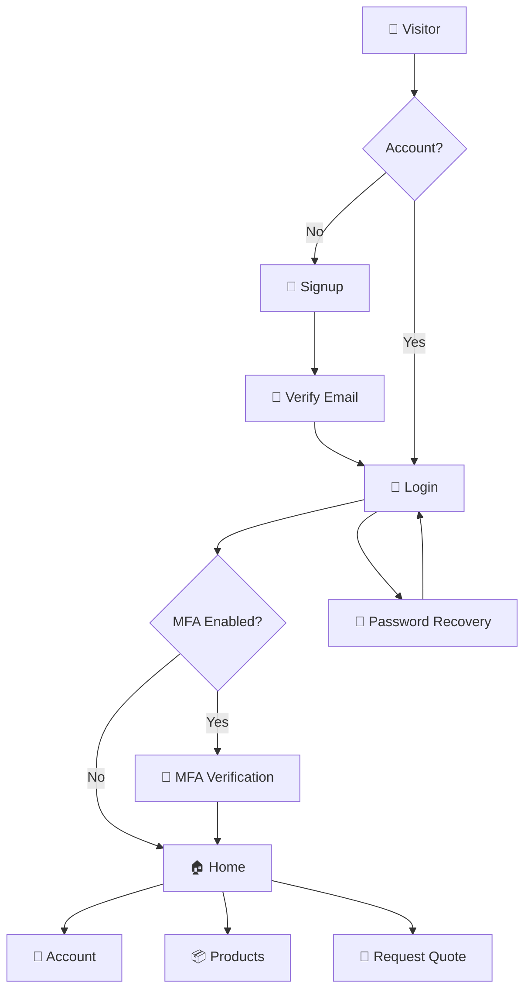
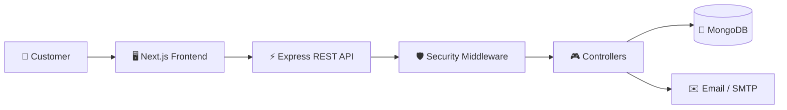

# 🖨️ Paras Printers — Full-Stack Packaging Platform

<p align="center">
  
  
  
  
</p>

> A modern, secure and responsive web platform for **Paras Printers**, built to showcase packaging and label products, manage customer accounts and support secure quotation workflows.

---

## ✨ Overview

**Paras Printers** is a full-stack web application designed for a packaging and label manufacturing business.

Customers can:

- Explore products and services
- Create and verify an account
- Securely log in
- Use MFA when enabled
- Recover forgotten passwords
- Manage their account
- Request quotations
- Use the platform across desktop, tablet and mobile

The application follows a modular architecture with a **Next.js frontend**, **Node.js + Express REST API**, and **MongoDB/Mongoose database**.

---

## 🚀 Key Features

- 🏠 Professional corporate homepage
- 📦 Product and service discovery
- 🧾 Request Quote workflow
- 📝 Secure registration and login
- ✉️ Email verification
- 🔑 Forgot/reset/change password
- 🛡️ Multi-factor authentication
- 🔐 MFA recovery codes
- 👤 Protected customer account
- 🍪 Secure authentication cookies
- 🧱 CSRF protection
- 🚦 Authentication rate limiting
- 🧪 Server-side request validation
- 🌙 Light/Dark theme
- 📱 Fully responsive UI
- 🧩 Reusable React/Next.js components

---

# 🛡️ Security Highlights

### 🔐 Authentication

```text
Signup
  ↓
Email Verification
  ↓
Login
  ↓
MFA (if enabled)
  ↓
Authenticated Session
  ↓
Account / Protected Features
```

### ✉️ Email Verification

Verification tokens are generated securely, stored in hashed form, expire after a configured period and cannot be reused.

### 🔑 Password Security

Passwords are hashed using **bcrypt** before being stored in MongoDB.

### 🛡️ MFA

Supports:

- Authenticator-based MFA
- MFA setup/confirmation
- MFA login verification
- MFA disabling
- Recovery codes

### 🍪 Secure Sessions

Authentication cookies use security-focused options such as:

```text
HttpOnly
Secure in production
SameSite
```

### 🧱 CSRF Protection

State-changing requests such as:

```text
POST
PUT
PATCH
DELETE
```

are protected against CSRF attacks.

### 🚦 Rate Limiting

Sensitive authentication endpoints are rate-limited to reduce brute-force and abuse attempts.

### 🔒 Protected APIs

Private endpoints use authentication middleware:

```js
router.get("/me", protect, getMe);
```

Sensitive values such as passwords, password hashes, secrets, MFA secrets and database credentials are never returned to the frontend.

---

# 🔄 Application Workflow



---

# 🏗️ Architecture



---

# 🧰 Technology Stack

| Layer | Technologies |
|---|---|
| Frontend | Next.js, React, JavaScript/JSX |
| Styling | Tailwind CSS, CSS Variables |
| Icons | Lucide React |
| State | React Context API |
| Backend | Node.js, Express.js |
| Database | MongoDB, Mongoose |
| Validation | Zod |
| Authentication | Secure Token/Session Architecture |
| Password Security | bcrypt |
| Email | Nodemailer + SMTP |
| Security | CSRF, Helmet, CORS, Rate Limiting |
| API | REST |

---

# 📁 Project Structure

```text
ParasPrintersNew/
│
├── frontend/
│   ├── app/
│   ├── components/
│   ├── context/
│   ├── lib/
│   ├── public/
│   └── package.json
│
├── backend/
│   ├── src/
│   │   ├── config/
│   │   ├── controllers/
│   │   ├── middleware/
│   │   ├── models/
│   │   ├── routes/
│   │   ├── utils/
│   │   ├── validators/
│   │   └── server.js
│   └── package.json
│
└── README.md
```

---

# 📡 Important API Endpoints

| Method | Endpoint | Access |
|---|---|---|
| POST | `/api/auth/signup` | Public |
| POST | `/api/auth/login` | Public |
| POST | `/api/auth/logout` | Auth Flow |
| GET | `/api/auth/me` | Protected |
| GET | `/api/auth/verify-email` | Public |
| POST | `/api/auth/resend-verification` | Public |
| POST | `/api/auth/forgot-password` | Public |
| POST | `/api/auth/reset-password` | Public |
| POST | `/api/auth/change-password` | Protected |
| POST | `/api/auth/verify-mfa` | Auth Flow |
| POST | `/api/auth/verify-mfa-recovery` | Auth Flow |
| POST | `/api/auth/mfa/setup` | Protected |
| POST | `/api/auth/mfa/confirm` | Protected |
| POST | `/api/auth/mfa/disable` | Protected |

---

# ⚙️ Getting Started

## Prerequisites

- Node.js
- npm
- Git
- MongoDB Atlas or local MongoDB
- SMTP/email provider

### 1. Clone

```bash
git clone <YOUR_GITHUB_REPOSITORY_URL>
cd ParasPrintersNew
```

### 2. Backend

```bash
cd backend
npm install
```

Create `backend/.env`:

```env
NODE_ENV=development
PORT=5000
MONGODB_URI=your_mongodb_connection_string
CLIENT_URL=http://localhost:3000

CSRF_SECRET=your_secret
JWT_SECRET=your_secret

SMTP_HOST=smtp.gmail.com
SMTP_PORT=465
SMTP_SECURE=true
SMTP_USER=your_email@example.com
SMTP_PASSWORD=your_app_password
EMAIL_FROM=your_email@example.com

EMAIL_VERIFICATION_URL=http://localhost:3000/verify-email
PASSWORD_RESET_URL=http://localhost:3000/reset-password
```

### 3. Frontend

```bash
cd frontend
npm install
```

Create `frontend/.env.local`:

```env
NEXT_PUBLIC_API_URL=http://localhost:5000/api
```

### 4. Run Backend

```bash
cd backend
npm start
```

### 5. Run Frontend

```bash
cd frontend
npm run dev
```

Open:

```text
http://localhost:3000
```

---

# 🧪 Testing Flow

```text
Signup
 ↓
Verify Email
 ↓
Login
 ↓
MFA (if enabled)
 ↓
Home
 ↓
Navbar → User Avatar + Name
 ↓
My Account
 ↓
Logout
```

Also test:

- Forgot password
- Password reset
- MFA recovery
- Invalid/expired verification links
- Protected API routes
- Rate limiting
- CSRF-protected requests

---

# 🚀 Production Checklist

Before deployment:

- [ ] Never commit `.env` files
- [ ] Use strong production secrets
- [ ] Enable HTTPS
- [ ] Enable secure cookies in production
- [ ] Configure production CORS
- [ ] Configure MongoDB Atlas securely
- [ ] Configure SMTP securely
- [ ] Keep CSRF and rate limiting enabled
- [ ] Remove sensitive debug logs
- [ ] Never expose passwords/secrets in API responses
- [ ] Test authentication, MFA and password recovery

---

# 🔮 Future Enhancements

- 🛒 Shopping cart and ordering
- 💳 Online payments
- 📦 Order tracking
- 👨‍💼 Admin dashboard
- 📊 Business analytics
- 📧 Advanced notifications
- 💬 WhatsApp integration
- ☁️ Redis caching
- ⚙️ Background job processing
- 🚀 CI/CD and cloud scaling

---

# 👨‍💻 Author

**Ashwani Pandey**  
Full-Stack Developer

- GitHub: https://github.com/ApAshwani142
- LinkedIn: https://www.linkedin.com/in/ashwani-pandey-12a068376

---

<p align="center">
  <strong>🖨️ Paras Printers</strong><br>
  <sub>Secure • Scalable • Professional • Customer-focused</sub>
</p>

<p align="center">⭐ If you like the project, consider giving the repository a star!</p>
